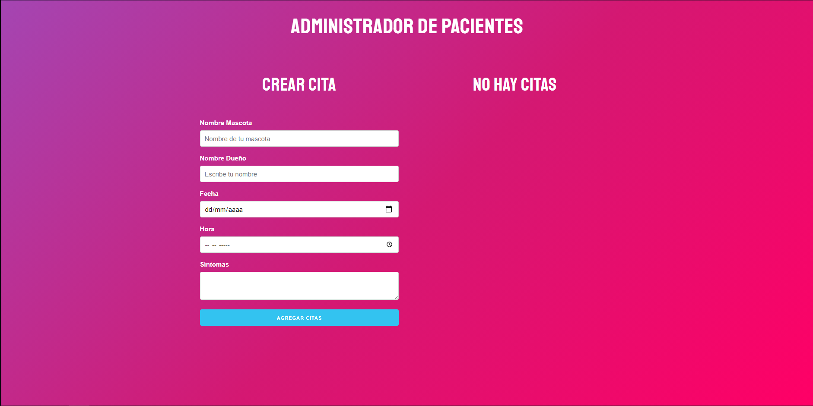
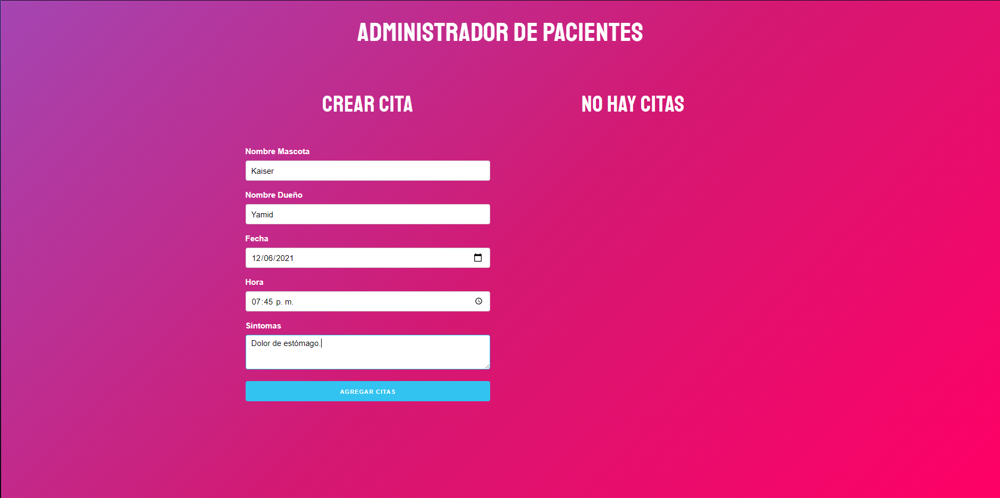
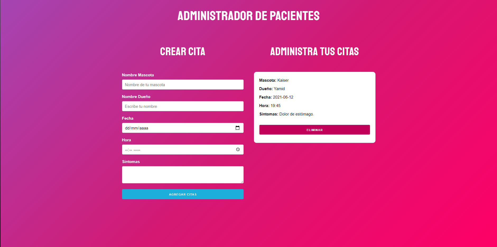

# App-date

Esta es mi primera app creada con react.js
App guiada por el curso: React - La Guía Completa: Hooks Context Redux MERN +15 Apps, dictado por Juan Pablo De la torre Valdez

This project was bootstrapped with [Create React App](https://github.com/facebook/create-react-app).

## Available Scripts

para iniciar el proyecto:

### `npm start` 

Esto ejecutará la app en modo de desarrollo.\
Open [http://localhost:3000](http://localhost:3000) para verla en el navegador.

